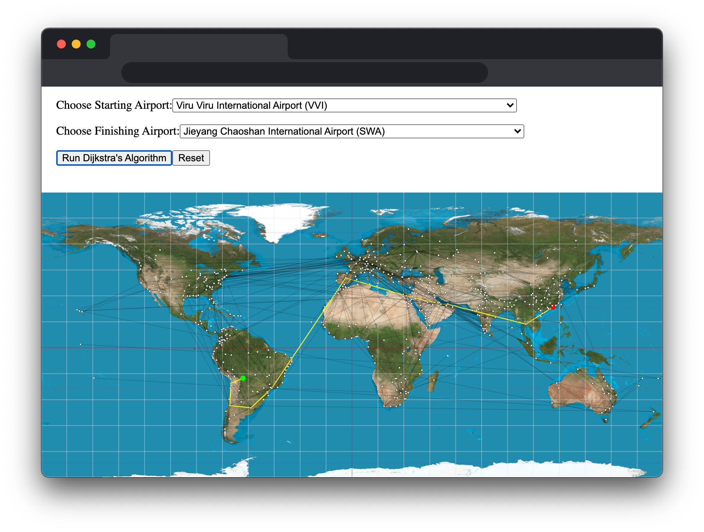

# Dijkstra's Trip

* **Try it out:** [https://dijkstra-wlotherington.herokuapp.com/](https://dijkstra-wlotherington.herokuapp.com/)
* **Stack:** `React`
* **Feedback:** [Will.Lotherington@hey.com](Will.Lotherington@hey.com)

### What is it?
React app to find the shortest distance between 2 airports based on an (non exhaustive) list of airline routes flown in and out of each airport.

The app uses Dijkstra's algorithm to find the shortest path based on distance. The distance is calculated based on the latitude & longitude of the airports and often differs from teh graphical path displayed on the screen (no flights go over the pacific).

### Potential Improvements
* Refactor code... all of it needs a lot of work
* Deploy as production, not development
* Allow user to click on the map instead of using the dropdown
* Display the shortest path routes in an easily readable format
* Filter airports on map once the starting point it selected to only show reachable airports.
* Improve flight path by allowing flights to go over the pacific.
* Add game feature where the user can race the algorithm at different levels of difficulty.
